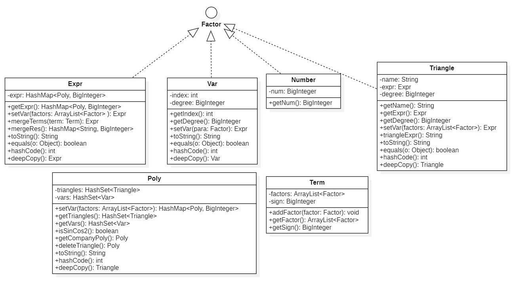

## 面向对象第一单元总结

### 前言

本文的主要内容有以下三点：

- OO第一单元三次作业的设计思路，代码架构和复杂度分析
- 分析产生容易产生bug的易错点
- 总结经验教训

### 一、三次作业的架构设计

​	OO第一单元的题目是表达式解析，要求我们的程序具有以下三个基本功能：

1. 表达式的读取和存储
2. 表达式的化简
3. 表达式的输出

其中程序的性能主要体现在第二点表达式化简上。由于笔者的第二次作业已经具备了第三次作业的功能，所以下面以第一三次作业为例，介绍自己的设计思路和程序架构。

### 1.第一次作业

#### 1.1 题目分析与大致思路

​	第一次作业只支持单层括号，x的幂函数，常数。训练栏目递归下降的做法为我们**读取表达式**提供了一个可行的思路。针对第一次作业中表达式仅是关于`x`的一个多项式，我采用了`HashMap<Integer, BigInteger>`来**存储表达式**，其中每一个键值对`<Integer,BigInteger>`代表每一项x的指数`degree`和系数`coef`。对于**表达式的合并和化简**，仅需要将具有相同`degree`的项的`coef`相加即可。实现**表达式的输出**时我在`Expr`类中构建了一个`toString`方法，将表达式输出。

	##### 一些小trick

 - 针对表达式中连续`+-`号的问题：
   	- 我的做法是将`+-`号与项相关联。具体来说是设定一个`sign = 1`，依次读取表达式，读到`-`时令`sign = - sign`，直到读到项，再将这个`sign`作为项的一个`Attribute`保存在项中，待到合并项的时候乘以`sign`即可，这样我们就可以读取项之间具有任意个数`+-`的表达式了。
 - 统一采用`Hashmap<Integer,BigInteger>`记录常数因子，幂函数因子和多项式因子，并在上述三个类`Number`，`Power`，`Expr`中统一实现`factor`接口声明的`getTerms():Hashmap<Integer,BigInteger>`方法，这样我们在将因子合并成多项式时就无需使用`instance of`关键字分类讨论，直接使用`getTerms()`函数即可

#### 1.2具体实现

为了实现上述功能，我构建了如下的接口和类：


我将上图中的接口和类分为两类：

1. materials


它们是组成表达式的材料，包括`Number`常数因子，`Power`幂函数因子，`Expr`表达式和表达式因子，`Factor`因子接口，`Term`项

2. tools


它们是表达式解析化简的工具，包括：

1. `Lexer`：单词扫描器，功能是从头到尾扫描整个字符串，组合单个字符为“词”，将组合好的“词”输出给`Parser`。其中包含两个字符以上的词有：`**`。

2. `Parser`：语法分析器，功能是分析从`Lexer`中传来的词的作用以及词与词之间的关联，即哪些词是操作符，哪些词是因子；哪些词之间组成了项，哪些词之间构成了表达式。这里采用了训练项目的递归下降算法。

3. `Calculator`：计算器：能够支持一些必要的计算，在本次作业中具有的功能包括

   1. 求表达式因子的幂次方

      `public HashMap<Integer, BigInteger> power(Factor expr, int times)`

   2. 项合并到表达式中

      `public HashMap<Integer, BigInteger> termToExpr(Term term) `

#### 1.3 程序结构复杂度分析

代码规模：


基于方法的程序结构复杂度分析：


基于类的程序结构复杂度分析：


`Expr.toString()`的认知复杂度，设计复杂度和圈复杂度高，其原因是在输出最终表达式时做了一些优化，导致方法中`if-else`块多，甚至出现多层嵌套，独立路径条数增多，复杂度更高。


### 2.第三次作业

#### 2.1 题目分析与大致思路

​	相比于第一次作业，第三次作业增加的部分有：自定义函数，三角函数，求和函数，括号的嵌套。同时函数的存在也意味着我们必须实现另一个必要的基本功能：**向表达式赋值**

​	由于输入的表达式不再是`coef*x**degree`的形式，第一次作业存储表达式的方法和大部分合并方法无法满足第三次作业的要求，为此我进行了完全的重构。

​	重新构建后的表达式树如下：

```java
表达式 Expr: HashMap<Poly, BigInteger>
多项式 Poly: HashSet<Triangle> triangles && HashSet<Var> vars
三角函数因子 Triangle
变量因子 Var
Expr = BigInteger * Poly + BigInteger * Poly + ...
Poly = Var1 * Var2 * ... * Triangle1 * Triangle2 * ...
Var = var_name ** degree
Triangle = (name == sin)? sin(expr) ** degree : cos(expr) ** degree 
```

​	按照训练栏目中递归下降的方法**读取表达式**后，按照上文所示的方法**存储表达式**。对于**表达式的合并**，需要在`Poly`及与`Poly`相关联的`Triangle`，`Var`和`Expr`类重写`equal`方法，当判断出两个`Poly`相等时，将`Poly`的系数相加更新到`HashMap<Poly, BigInteger>`中。**表达式输出**时，我同样在`Expr`及与`Expr`相关联的`Triangle`，`Var`和`Poly`类重写`toString`方法，层次化实现表达式的输出。

##### 	自定义函数的处理和函数的赋值

​	笔者在处理自定义函数时，是按照同建模表达式的方法，对函数解析式进行建模，在读取函数时，不记录变量名字而是记录变量在函数定义式中出现的次序，并统一按照该次序将函数变量转化为`jkl`，便于后续的赋值操作。在对自定义函数建模完成后，将其保存到`FunctionBase`函数库中。

​	第三次作业的难点在于如何对函数中的变量赋值。函数赋值的本质是函数解析式中表达式的赋值，而表达式赋值的本质是组成表达式的变量的赋值。所以赋值是一个层次下降的过程，我们最终仅需要实现的是变量类`Var`的赋值。

​	由于`fgh`的参数个数不定，这对赋值造成了一定的困难。笔者在实现时向待赋值的`var`传递的是`ArrayList<Factor> factors`，出现次序为`i`的变量即将被赋值为`factors[i]`，若`factors[i] = null`则表示该函数无第`i`个变量，这样我们就可以对具有任意个参数的函数进行赋值了。

#### 2.2具体实现

为了实现上述功能，我构建了如下的接口和类：


我将上图中的接口和类分为三类：

1. materials



它们是组成表达式的材料，包括`Number`常数因子，`Var`变量因子，`Expr`表达式和表达式因子，`Triangle`三角函数因子，`Factor`因子接口，`Term`项，`Poly`多项式。

2. functions


它们是表达式中的函数，包括`Triangle`三角函数，`Custom`自定义函数，`Sum`求和函数，`FunctionBase`函数库。

3. tools


它们是表达式解析化简的工具，包括：

1. `Lexer`：单词扫描器，功能是从头到尾扫描整个字符串，组合单个字符为“词”，将组合好的“词”输出给`Parser`。其中包含两个字符以上的词有：`**`，`sin`，`cos`，`sum`。

2. `Parser`：语法分析器，功能是分析从`Lexer`中传来的词的作用以及词与词之间的关联，即哪些词是操作符，哪些词是因子；哪些词之间组成了项，哪些词之间构成了表达式。这里采用了训练项目的递归下降算法。

3. `Calculator`：计算器：能够支持一些必要的计算，在本次作业中具有的功能包括

   1. 变量因子相乘

      `public HashSet<Var> multVars(HashSet<Var> vars1, HashSet<Var> vars2)`

   2. 三角函数因子相乘

      `public HashSet<Triangle> multTriangles(HashSet<Triangle> triangles1, HashSet<Triangle> triangles2)`                                     

   3. 表达式因子相乘

      `public HashMap<Poly, BigInteger> multExpr(HashMap<Poly, BigInteger> expr1, HashMap<Poly, BigInteger> expr2)`

   4. 表达式因子的幂次方

      `public HashMap<Poly, BigInteger> power(Expr expr, BigInteger times)`

   5. 合并多项式

      `public Poly mergePoly(Poly poly1, Poly poly2)`

   6. 合并表达式

      `public HashMap<Poly, BigInteger> mergeExpr(HashMap<Poly, BigInteger> expr1, HashMap<Poly, BigInteger> expr2)`

   7. 合并项和表达式

      `public HashMap<Poly, BigInteger> termToExpr(Term term) `

#### 2.3 程序结构复杂度分析

代码规模：


基于方法的程序结构复杂度分析（部分）：


基于类的程序结构复杂度分析：


复杂度较高的方法主要归结为两类：

​	一类是`toString()`方法，如`Expr.toString()`、`Triangle.toString()`这类方法由于在输出时需要特判诸多情况，出现`if-else`嵌套或并列较多，认知复杂度，设计复杂度和圈复杂度高

​	另一类是表达式输入解析方法，典型的是`Parser.parseFactor()`，这类方法同样需要根据不同的输入情况进行讨论分析，同样出现`if-else`嵌套或并列较多，认知复杂度，设计复杂度和圈复杂度高。

以上两类方法的复杂度较高是难以避免的，同时由以上两类方法引发的bug也是最多的，这需要我们在日常编码中多多关注以上两类方法。

### 二、bug分析和hack策略

​	三次作业中笔者未被发现bug，个人认为消灭bug有两种方法：

​		一是自己尽可能多的考虑可能的边界条件，我们可以在着手写代码之前先进行头脑风暴，将自己想到的，可能出现的特殊情况记下来，等到写完代码再用来测试。

​		二是分析别人出现过的bug，看这些bug是否会在自己的程序中出现。有些bug具有典型性，比如本次作业中由深拷贝引起的bug，是我们需要重点关注的问题。

​	我认为互测是一个欣赏同学代码的好机会。通过互测也看到了很多优秀同学的代码，有同学能把代码优化到极致，有同学能想到用更好更精妙的方法构建表达式树。互测hack的策略一般是在浏览互测屋子里同学的代码的过程中，发现可能产生的错误。在根据不同同学的代码设计测试用例时，我会寻找长的、复杂的、条件判断多、逻辑不清晰或者优化过的的方法进行测试，往往这种地方也比较容易产生bug。

### 三、总结经验教训

​	第一单元的三次作业让我印象最为深刻的是Java层次化设计的编程思想。通过将表达式按照父类与子类，包含与被包含的关系进行形式化建模，便可以将复杂问题分解成简单问题进行解决。我也意识到了当面对一个复杂问题时，好的设计往往能让我们事半功倍。当然，仅凭自己的思考未必能够得到最佳结果，我们还需要敢于试错敢于重构。我第一单元的作业写了有三版，最终才找到一个较为合理的写法。

​	第一单元的不足之处首先是对于Java的容器和一些典型方法了解的不够充分，以至于自己的一些想法不知道如何用Java来实现，甚至需要边写代码边百度Java库操作；其次是自己对指导书这种长题目的阅读和理解较慢，总是询问同学某种情况能不能出现，而不是自己先阅读指导书进行独立思考。以上两点是我今后要解决的问题。


​	


