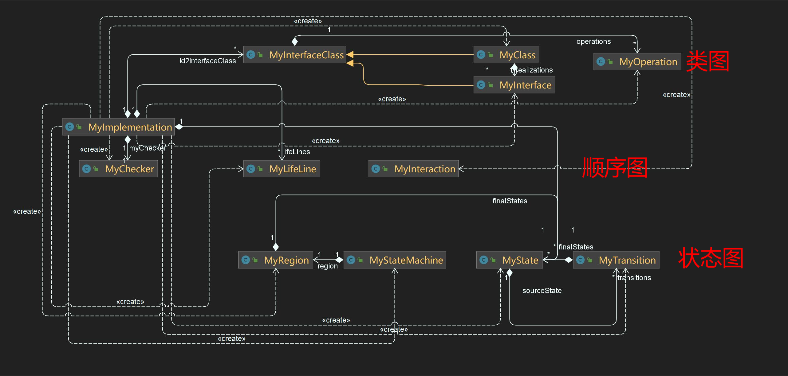

# 面向对象第四单元总结


## 一、本单元的架构设计

​	本单元代码的功能主要分为两大部分，一是读取UML图，从图中读取并保存我们需要的信息；二是根据保存的信息，进行要求的九个正确性判断，并满足用户提出的query。
​	整体而言，我的架构几乎就是对UML图中元素的仿写，设计了`MyClass, MyInteraction, MyInterface, MyInterfaceClass, MyLifeLine, MyOperation, MyRegion, MyState, MyStateMachine, MyTransition`来保存其中的关联、包含、泛化、组合等关系。在检验UML图的正确性时，我设计了MyChecker类，对九种异常进行检验。
​	具体来说：在读取UML图时，由于标准输入的UML图中元素的顺序是随机的，因此很可能出现诸如先读到attribute后读到attribute所在的类等情况。为此，我采用的方法是逐层对UML图中的元素进行读取，我分成了一下五层：

1. interface, class, interaction, statemachine
2. interface_realization, generalization, attribute, operation, region
3. parameter, lifeline, endPoint, state, FinalState, PseudoState, association_end  类似于图上的点
4. message, transition, Association  类似于连接第三层中点的线
5. event  对第四层线的修饰

​	在**读取UML图信息**时，进行level1~level5五次扫描，每次只读取属于当前层的元素。在读取每层元素时，可以保证与其相关联的元素已经在上层中读取完成并得到保存。这样就解决了UML图信息读取的问题。
​	在**查询UML图中信息**时，由于很多信息在读取时已经有针对性地保存好了，对于大部分的查询只需要几行代码输出已经保存的信息即可，比较容易。最大的难题其实是理解指导书的需求，以及指导书对一些定义、概念和特殊情况的说明。易错的查询主要有查询类操作和属性的耦合度(CLASS_OPERATION_COUPLING_DEGREE & CLASS_ATTR_COUPLING_DEGREE)以及查询状态是否是关键状态(STATE_IS_CRITICAL_POINT)，需要仔细阅读指导书的定义。
​	在**进行UML图正确性检查**时，CheckStyle的限制逼着我设计了一个MyChecker类，对九种异常检验进行封装。封装完整整齐齐感觉还不错哈哈，强迫症狂喜：

```java
public void checkForUml001() throws UmlRule001Exception {
    myChecker.checkForUml001(this.error1);
}

public void checkForUml002() throws UmlRule002Exception {
    myChecker.checkForUml002(name2class.values());
}

public void checkForUml003() throws UmlRule003Exception {
    myChecker.checkForUml003(id2interfaceClass);
}

public void checkForUml004() throws UmlRule004Exception {
    myChecker.checkForUml004(id2interfaceClass);
}

public void checkForUml005() throws UmlRule005Exception {
    myChecker.checkForUml005(this.error5);
}

public void checkForUml006() throws UmlRule006Exception {
    myChecker.checkForUml006(lifeLines);
}

public void checkForUml007() throws UmlRule007Exception {
    myChecker.checkForUml007(lifeLines);
}

public void checkForUml008() throws UmlRule008Exception {
    myChecker.checkForUml008(finalStates);
}

public void checkForUml009() throws UmlRule009Exception {
    myChecker.checkForUml009(states, id2elm);
}
```

UML类图如下：




## 二、架构设计思维及OO方法理解的演进

### Pre

​	我认为自己的寒假预习还是比较认真的，一步步的按照教程要求做完了冒险者这个项目，也自己设计了一个MessageBase对发送的消息进行封装并提供查询功能。但是我当时对面向对象的理解还十分浅显：是不是面向对象就是为了将两个含有相同属性或方法的类中相同的部分提取出来，构造一个父类，这样写一份代码就行了，方便又省代码。

	### 第一单元

​	第一单元的表达式解析作业对我的面向对象思维的训练是巨大的。现在回顾我第一单元的代码，里面已经丰富的显现出了封装继承多态等面向对象特征。训练栏目的递归下降算法给了我较大的启发，让我看到了层次化思想的精妙之处：表达式、项、因子作为三个层次，每一层仅需要专注于处理本层的拆分和合并即可，因子层次处理因子的合并得到项交给上一层，项层次处理项的合并得到表达式交给上一层，表达式层次处理表达式的合并得到结果。本单元的架构是分别将表达式，项和因子抽象成类，在类中实现表达式化简需要的方法。
​	同时这一单元加深了我对为什么要面向对象编程这个问题的理解，做pre时我曾认为面向对象的最大的好处是通过构造一个父类实现两个子类共有方法从而省下代码，现在看来这种想法显然是舍本逐末。面向对象最大的好处是通过对我们需要解决的问题中的客观存在的对象进行模拟和抽象，将一组关联度高的属性和方法封装在一起，降低类之间的耦合度，每个类作为大系统中的一部分，完成各自的小功能，这样通过类之间的协作，就能实现一个大功能，有一种将难题分解成几个小问题再依次解决的感觉。

### 第二单元

​	第二单元电梯调度作业的主要收获是多线程代码的编写和很多的设计模式。架构设计要比第一单元简单，但是代码的编写时进行的逻辑分析比较难，主要是判断会不会发生忙等和死锁两个典型的多线程编码容易出现的让我很头疼。我的架构设计采用的是生产者消费者模式，老师课上还讲了包括单例模式，工厂模式，观察者模式等许许多多的设计模式，希望以后写代码时候能用到。

### 第三单元

​	第三单元是JML形式化描述语言的翻译，强调规格化。JML语言是一个严谨的形式化描述语言，需要仔细阅读理解规格描述，才能写出正确的代码，虽然简单，但很容易出错。

### 第四单元

​	第四单元是UML图的检索和正确性检验，理解UML图中各个元素的定义和相关关系是重中之重。仔细阅读指导书对各个概念的定义也是十分必要的。本单元的架构是将UML图中的元素抽象成类进行建模，在相应的类中实现指导书的要求的功能即可。


## 三、总结自己在四个单元中测试理解与实践的演进

​	测试分为黑盒测试和白盒测试：
​	黑盒测试也称功能测试，测试中把被测的软件当成一个黑盒子，不关心盒子的内部结构是什么，只关心软件的输入数据与输出数据。我测试时候前先是用评测机生成随机数据测试，常规的大量数据测完后接着手搓一些刁钻的边界数据测试。
​	白盒测试是基于代码的测试。白盒指的打开盒子，去研究里面的源代码和程序结果。这部分我是先记录下指导书中的一些关键点和易错点，看自己或互测屋子成员的代码是否正确处理了。
​	好像一直都是评测机自动化测试+手搓数据这样的测试方法，要说测试部分的提高可能就是写的评测机生成的数据情况覆盖率更高了，构造的数据更边界了，读代码时候能更快发现代码中可能存在的错误，对代码中可能隐藏的错误更敏感了。

## 四、课程收获

​	第一单元学到了递归下降算法，层次化设计思想，面向对象封装继承多态的设计思想；
​	第二单元简单地学习了多线程编程方法，了解了Java中的多种锁，掌握了死锁和忙等的分析和避免方法，动手实践了多种电梯调度算法，了解和应用了多种设计模式；
​	第三单元学习了JML形式化语言和规格化编程，随带着学到了一些算法；
​	第四单元学习了UML图中的元素和内容，了解了UML图的几种错误类型和检查规则。

## 五、几个建议

 1. 关于作业布置顺序

    ​	我不知道课程组按照这个顺序布置作业有没有其它考虑(比如和OS课程中和难度等)，这个作业布置顺序真的很迷惑，~~感觉就是为了在学期开始给我们当头一棒，来个下马威~~，后两个单元的作业更像是入门的作业，经历过前两个单元的训练再做后面的作业给我一种繁琐和消沉的感觉，做OO作业的欲望和兴趣大幅衰减。第一单元作业尤其是第二次作业跨度比较大，当时花费了我一整天去思考架构设计，不适合首先学习。

2. 关于研讨课

      研讨课全员分组讨论这个模式真的很不错，但是我觉得最后的小组总结展示比较鸡肋。据我观察，最终的小组总结相似度极高，40多分钟的时间每个小组分享的都是那几点，都要被说烂了。我能想到的几个方法是适当扩大小组人数，硬性分配给每个小组不同的讨论问题，这样既能减弱小组组员缺勤的影响(两次四人组我人傻了)，同时每个小组都能分得更多的展示时间去详细展示各自独特的讨论方向。或者是通过研讨课后分享报告的方式进行组间的分享。

3. 关于CheckStyle
      每行一百字符的限制，破坏了我很多不换行会很工整的代码，倒是不易读了。我记得IDEA原来的限制是120，建议考虑增加一点。
4. 关于实验课
   第二单元理论课讲了很多设计模式，也拓展了好多锁，但是编码时尝试的不多，希望能在实验课上多出一些相关的题目练习一下。

AnyWay，本学期面向对象课程给我带来了难以估量的收获，非常感谢为这门课辛苦付出的老师和助教，感谢这一路上帮助过我的同学谢谢你们！🥰

